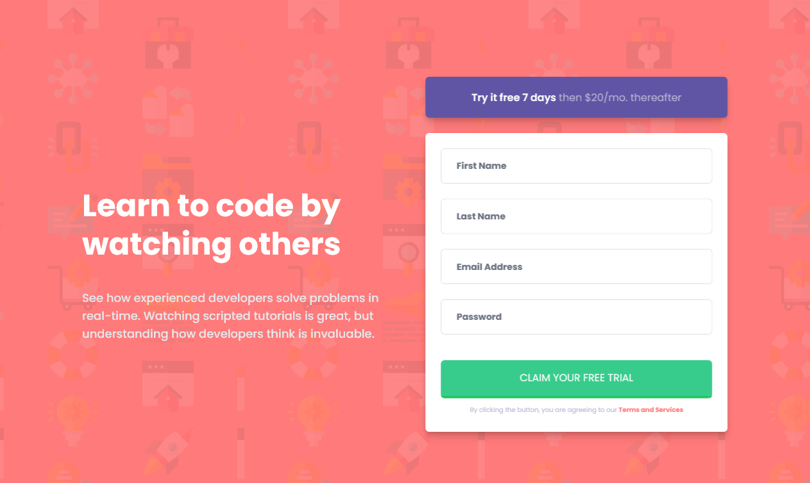

# Frontend Mentor - Intro component with sign up form solution

This is a solution to the [Intro component with sign up form challenge on Frontend Mentor](https://www.frontendmentor.io/challenges/intro-component-with-signup-form-5cf91bd49edda32581d28fd1). 

## Table of contents

- [Overview](#overview)
  - [The challenge](#the-challenge)
  - [Screenshot](#screenshot)
  - [Links](#links)
- [My process](#my-process)
  - [Built with](#built-with)
  - [What I learned](#what-i-learned)
  - [Continued development](#continued-development)
  - [Useful resources](#useful-resources)
- [Author](#author)
- [Acknowledgments](#acknowledgments)


## Overview

### The challenge

Users should be able to:

- View the optimal layout for the site depending on their device's screen size
- See hover states for all interactive elements on the page
- Receive an error message when the `form` is submitted if:
  - Any `input` field is empty. The message for this error should say *"[Field Name] cannot be empty"*
  - The email address is not formatted correctly (i.e. a correct email address should have this structure: `name@host.tld`). The message for this error should say *"Looks like this is not an email"*

### Screenshot



### Links

- Solution URL: [FrontendMentor.io](https://your-solution-url.com)
- Live Site URL: [Vercel](https://prj-01-intro-component-with-signup-form.vercel.app/)

## My process

### Built with

- Semantic HTML5 markup
- CSS custom properties
- Flexbox
- TailwindCSS
- Mobile-first workflow
- DOM manipulation with Javascript


### What I learned

I use tailwind classes to change styles  but also Javascript. The border color was not modified natively in Tailwindcss so I decided change it from Javascript.

How to validate email with Javscript regex:

```js
const emailRegex = /^\D.*@\D*\w*\.\w*/;
//...
if (!emailInput.value || !emailRegex.test(emailInput.value)) {
    exclamationMail.classList.replace("invisible", "visible");
    errorMail.classList.replace("invisible", "visible");
    emailContainer.style.borderColor = "hsl(0, 100%, 74%)";
    emailInput.style.color = "hsl(0, 100%, 74%)";
```

How to validate data once submit button is pressed
```js
button.addEventListener("click", (e) => {
  e.preventDefault();
  validateFields();     //call the function
});```

### Continued development

Future projects will be developed using TailwindCSS and Javascript when interactivity must be included.

### Useful resources

- [TailwindCSS Directives](https://tailwindcss.com/docs/functions-and-directives) - Use of @apply directive
- [Form states](https://tailwindcss.com/docs/hover-focus-and-other-states#form-states) - Style form elements in different states using modifiers like required, invalid, and disabled.
- [Customizing Colors in TailwindCSS](https://tailwindcss.com/docs/customizing-colors) - Adding personalized color names to be used in tailwindcss.
- [Customizing Fonts in TailwindCSS](https://tailwindcss.com/docs/font-family#using-custom-values) - Adding Google fonts to be used in tailwindcss.

## Author

- Website - [Gustavo Sanchez](https://www.gusanche.dev)
- Frontend Mentor - [@gusanchedev](https://www.frontendmentor.io/profile/gusanchedev)
- Github - [@gusanchedev](https://www.github.com/gusanchedev)
- Twitter - [@gusanchedev](https://www.twitter.com/gusanchedev)
- Linkedin - [gusanchedev](https://www.linkedin.com/in/gusanchedev/)

## Acknowledgments

Thanks to Mariapaz for being my friend and support 💙
